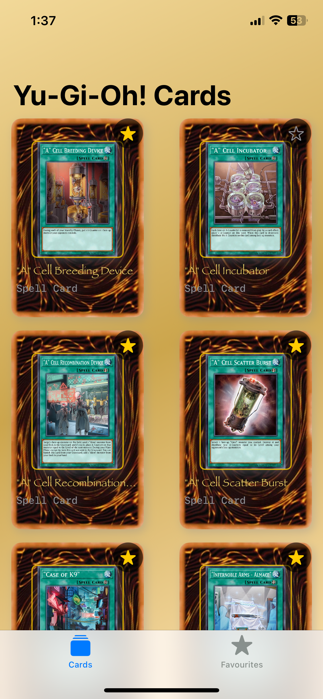
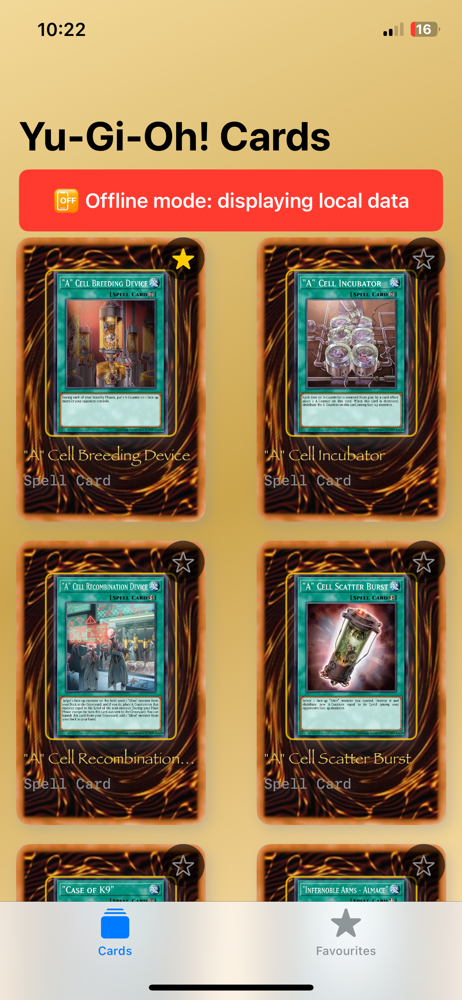

# KapitalChallengeApp – Yu-Gi-Oh! Cards Browser

**KapitalChallengeApp** is an iOS app developed in **SwiftUI** that allows users to browse Yu-Gi-Oh! cards from a public API, mark them as favorites, and access them offline thanks to Core Data.

---

## Features

- Fetch cards from [YGOProDeck API](https://db.ygoprodeck.com/api-guide/)
- Pagination with "Load More" functionality
- Add and remove cards from Favorites
- Offline mode with Core Data
- Modern architecture: Clean Architecture + MVVM
- Unit tested with mock networking
- Cached image loading with `URLCache`
- Search bar

---

## Architecture Overview

The project follows **Clean Architecture + MVVM**, divided into the following layers:

```
KapitalChallengeApp
├── Data
│   ├── Interfaces
│   │   ├── CardLocalDataSourceProtocol.swift
│   │   └── YuGiOhAPIServiceProtocol.swift
│   ├── Network
│   │   ├── NetworkMonitor.swift
│   │   └── YuGiOhAPIService.swift
│   └── Persistence
│       ├── CardLocalDataSource.swift
│       ├── Extension.swift
│       └── Persistence.swift
├── Domain
│   └── Model
│       └── YuGiOhCardModel.swift
├── Presentation
│   ├── View
│   │   ├── Components/
│   │   │   ├── CachedAsyncImage.swift
│   │   │   └── CardRowView.swift
│   │   ├── DetailView/
│   │   │   └── CardDetailView.swift
│   │   ├── Favorites/
│   │   │   ├── FavoriteRowView.swift
│   │   │   └── FavoritesView.swift
│   │   ├── HomeView.swift
│   │   └── LaunchScreen.storyboard
│   └── ViewModel/
│       └── YuGiOhViewModel.swift
├── Preview Content
│   └── Assets.xcassets
├── Tests
│   └── KapitalChallengeAppTests/
│       ├── URLProtocolMock.swift
│       └── YuGiOhAPIServiceTests.swift
```

---

## Testing

The `YuGiOhAPIService` is unit tested using `XCTest` with a mock URL protocol:

### Tested:

- Successful response decoding
- Network mocking with `URLProtocolMock`

### Run Tests:

```bash
⌘ + U  // or use Xcode's Test Navigator
```

---

## Screenshots

| Home View             | Detail View            | Favorites View         | Offline Mode            |
|-----------------------|------------------------|-------------------------|--------------------------|
|  |  |  |  | 

> Place your actual screenshots in a `screenshots/` folder inside the root of the project and update the paths if needed.

---

## API Reference

- Base URL: `https://db.ygoprodeck.com/api/v7/cardinfo.php`
- Supports parameters like:
  - `num`: Number of cards to return
  - `offset`: Offset for pagination

Example:
```
https://db.ygoprodeck.com/api/v7/cardinfo.php?num=20&offset=0
```

---

## Local Persistence

- Cards fetched from the API are stored using Core Data via `CardLocalDataSource`.
- Favorite cards are persisted across app launches.
- Offline mode automatically activates when no connection is detected using `NetworkMonitor`.

---

## Core Technologies

- **Swift 5.9+**
- **SwiftUI**
- **Combine (via `@Published`)**
- **Core Data**
- **URLSession + async/await**
- **Clean Architecture + MVVM**
- **XCTest + URLProtocolMock**

---

## Author

**Gil CasRam** – *iOS Developer*  
Feel free to reach out for improvements, suggestions, or collaboration.

---

## License

This project is provided for educational and demonstration purposes.
